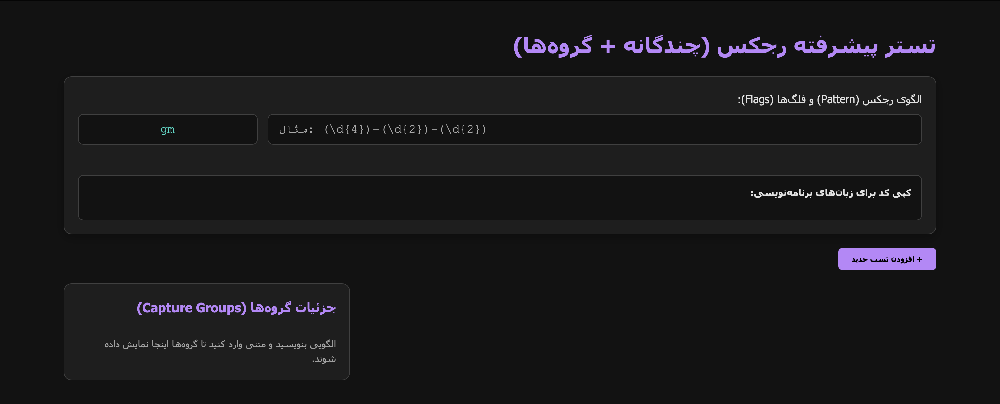
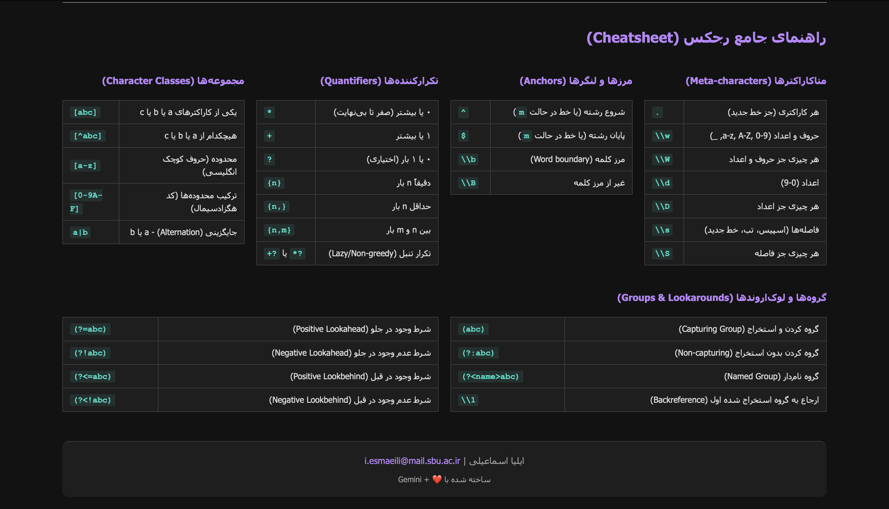

# 🔍 تست‌کننده مستقل RegEx و راهنمای کامل RexEx

یک ابزار حرفه‌ای، توانمند و با تم تیره برای تست عبارات باقاعده (Regex) که به صورت یک فایل `index.html` واحد و مستقل طراحی شده است.

این پروژه به‌طور اختصاصی برای کارکرد آفلاین در شبکه‌های محدود و اینترانت‌ها (مانند اینترنت ملی ایران) مهندسی شده است. این ابزار به هیچ وابستگی خارجی، CDN یا فراخوانی API نیاز ندارد.

تولید شده با استفاده از مهندسی پرامپت توسط **Google Gemini**.

---

## 📑 فهرست مطالب

- [درباره برنامه تست‌کننده](#-درباره-برنامه-تست‌کننده)
  - [ویژگی‌ها](#ویژگی‌ها)
  - [روش استفاده](#روش-استفاده)
  - [اسکرین‌شات‌ها](#اسکرین‌شات‌ها)
- [راهنمای کامل Regex](#-راهنمای-کامل-regex)
  - [عبارت باقاعده (Regex) چیست؟](#عبارت-باقاعده-چیست)
  - [فلگ‌های RegExp در جاوااسکریپت](#فلگ‌های-regexp-در-جاوااسکریپت)
  - [اصلاح‌کننده‌های گروه در RegExp](#اصلاح‌کننده‌های-گروه-در-regexp)
  - [ویژگی‌های فلگ در Regex جاوااسکریپت](#ویژگی‌های-فلگ-در-regex-جاوااسکریپت)
  - [متدهای عبارات باقاعده](#متدهای-عبارات-باقاعده)
  - [کلاس‌های کاراکتری RegExp](#کلاس‌های-کاراکتری-regexp)
  - [متاکاراکترهای RegExp](#متاکاراکترهای-regexp)
  - [اظهارات (لنگرها و مرزها) در RegExp](#اظهارات-لنگرها-و-مرزها-در-regexp)
  - [کمی‌سازها (Quantifiers) در RegExp](#کمی‌سازها-در-regexp)
  - [گروه‌های RegExp](#گروه‌های-regexp)
- [الگوهای رایج Regex](#-الگوهای-رایج-regex)
- [استفاده از Regex در زبان‌های برنامه‌نویسی](#-استفاده-از-regex-در-زبان‌های-برنامه‌نویسی)
  - [JavaScript](#javascript)
  - [Python](#python)
  - [PHP](#php)
  - [Java](#java)
  - [C#](#c)
- [نویسنده و اعتبار](#-نویسنده-و-اعتبار)

---

## 💻 درباره برنامه تست‌کننده

### ویژگی‌ها
- **۱۰۰٪ آفلاین و مستقل:** بدون CSS یا JS خارجی. در اتصالات اینترنتی محدود نیز به‌خوبی کار می‌کند.
- **هایلایت زنده:** نتایج جستجو را بلافاصله پس از تایپ مشاهده کنید.
- **تست‌کیس‌های چندگانه:** مدیریت جعبه‌متن‌های مستقل برای تست سناریوهای مختلف.
- **بصری‌سازی گروه‌های کپچر:** استخراج و رنگ‌بندی خودکار گروه‌های Regex در پنل کناری.
- **تولیدکننده قطعه‌کد:** تولید فوری کدهای آماده برای JavaScript، Python، PHP، Java و C#.
- **راهنمای داخلی (Cheatsheet):** شامل راهنمای جامع Regex در محیط کاربری.
- **حالت تیره (Dark Mode):** رابط کاربری چشم‌نواز طراحی شده با CSS خالص.

### روش استفاده
1. این مخزن را Clone کرده یا فایل `index.html` را دانلود کنید.
2. فایل `index.html` را در هر مرورگر مدرنی (Chrome، Firefox، Edge، Safari) باز کنید.
3. الگوی Regex و متن‌های مورد نظر برای تست را تایپ کنید.

### اسکرین‌شات‌ها




---

## 📚 راهنمای کامل Regex

> 💡 **نکته:** مخزن را Clone کرده و `index.html` را باز کنید تا تمام الگوهای زیر را به‌صورت تعاملی تست کنید!

### 🌍 آیا این راهنما برای همه زبان‌های برنامه‌نویسی است؟
**بله!**
اگرچه این ابزار با استفاده از HTML و JavaScript ساخته شده و از موتور Regex جاوااسکریپت برای تست زنده الگوها در مرورگر استفاده می‌کند، اما **مفاهیم اصلی عبارات باقاعده در این راهنما جهانی هستند.**

چه در حال برنامه‌نویسی با **Python، PHP، Java، C#، Ruby یا Go** باشید، مفاهیمی مانند متاکاراکترها (`\d`, `\w`)، کمی‌سازها (`*`, `+`, `?`)، اظهارات (`^`, `$`) و الگوهای رایج (ایمیل، شماره تماس و غیره) در زبان شما نیز کاربرد دارند. این راهنما همچنین شامل بخشی اختصاصی برای نحوه پیاده‌سازی این الگوها در زبان‌های مختلف است.

# عبارت باقاعده (Regex) چیست؟
عبارت باقاعده (Regex) توالی از کاراکترهاست که یک الگوی جستجو را تشکیل می‌دهد. هنگام جستجوی داده در یک متن، می‌توانید از این الگو برای توصیف دقیق آنچه به دنبال آن هستید استفاده کنید. این عبارت می‌تواند یک کاراکتر واحد یا یک الگوی پیچیده باشد.

### فلگ‌های RegExp در جاوااسکریپت
فلگ‌ها به انتهای الگوی Regex اضافه می‌شوند (مانند `/pattern/g`) تا رفتار آن را تغییر دهند.

| فلگ | توضیحات | مثال |
| :--- | :--- | :--- |
| `g` | **Global (سراسری):** یافتن تمام مطابقت‌ها به‌جای توقف پس از اولین مورد. | `/hello/g` |
| `i` | **Ignore Case (حساس نبودن به حروف بزرگ و کوچک):** جستجوی بدون حساسیت به حروف. | `/hello/i` |
| `m` | **Multiline (چندخطی):** کاراکترهای شروع (`^`) و پایان (`$`) را برای کار روی چندین خط تنظیم می‌کند. | `/^hello/m` |
| `s` | **DotAll:** به `.` اجازه می‌دهد تا کاراکترهای خط جدید را نیز شامل شود. | `/hello.world/s` |
| `u` | **Unicode:** الگو را به‌صورت توالی از کدهای یونیکد در نظر می‌گیرد. | `/^\u{1D306}$/u` |
| `v` | **Unicode Sets:** ارتقای فلگ `u` برای فعال‌سازی ویژگی‌های رشته‌ای و عملیات مجموعه‌ای. | `/[\p{ASCII}&&\p{Letter}]/v` |
| `y` | **Sticky:** تطبیق را فقط از ایندکس مشخص‌شده توسط ویژگی `lastIndex` انجام می‌دهد. | `/hello/y` |
| `d` | **Indices:** ایجاد ایندکس برای مطابقت‌های زیررشته‌ای. | `/foo/d` |

### اصلاح‌کننده‌های گروه در RegExp
*(پشتیبانی شده در ECMAScript 2025)*
شما می‌توانید فلگ‌ها را به‌صورت داخلی برای گروه‌های خاص با استفاده از `(?flag:pattern)` یا `(?-flag:pattern)` تغییر دهید.

| سینتکس | توضیحات | مثال |
| :--- | :--- | :--- |
| `(?i)` | فعال‌سازی جستجوی غیرحساس به حروف. | `(?i)hello` |
| `(?-i)` | غیرفعال‌سازی جستجوی غیرحساس به حروف. | `(?-i)hello` |
| `(?i:...)`| اعمال جستجوی غیرحساس به حروف بر روی یک گروه خاص. | `(?i:hello) world` |

### ویژگی‌های فلگ در Regex جاوااسکریپت
این‌ها ویژگی‌های بولی (True/False) فقط‌خواندنی در یک شیء RegExp در جاوااسکریپت هستند:
`global`, `ignoreCase`, `multiline`, `dotAll`, `unicode`, `unicodeSets`, `sticky`, `hasIndices`.

### متدهای عبارات باقاعده

**متدهای رشته (String Methods):**
- `match()`: آرایه‌ای شامل تمام مطابقت‌ها برمی‌گرداند.
- `matchAll()`: یک iterator شامل تمام مطابقت‌ها (به‌همراه گروه‌ها) برمی‌گرداند.
- `replace()`: یک زیررشته منطبق را با رشته جایگزین تعویض می‌کند.
- `replaceAll()`: تمام زیررشته‌های منطبق را تعویض می‌کند.
- `search()`: تست برای مطابقت و برگرداندن ایندکس آن.
- `split()`: تقسیم یک رشته به آرایه‌ای از زیررشته‌ها.

**متدهای RegExp:**
- `exec()`: اجرای جستجو و برگرداندن آرایه‌ای از اطلاعات (یا `null`).
- `test()`: تست برای وجود مطابقت و برگرداندن `true` یا `false`.

### کلاس‌های کاراکتری RegExp

| سینتکس | توضیحات |
| :--- | :--- |
| `[abc]` | مطابقت با هر یک از کاراکترهای `a`، `b` یا `c`. |
| `[^abc]` | مطابقت با هر کاراکتری *به‌جز* `a`، `b` یا `c`. |
| `[a-z]` | مطابقت با هر کاراکتری از `a` کوچک تا `z` کوچک. |
| `[A-Z]` | مطابقت با هر کاراکتری از `A` بزرگ تا `Z` بزرگ. |
| `[0-9]` | مطابقت با هر رقمی از ۰ تا ۹. |
| `[^0-9]`| مطابقت با هر کاراکتری که رقم نباشد. |

### متاکاراکترهای RegExp

| متاکاراکتر | توضیحات |
| :--- | :--- |
| `.` | یافتن یک کاراکتر تکی، به‌جز خط جدید یا پایان‌دهنده خط. |
| `\w` | یافتن یک کاراکتر کلمه (حروف الفبا، اعداد و زیرخط). |
| `\W` | یافتن یک کاراکتر غیر کلمه. |
| `\d` | یافتن یک رقم. |
| `\D` | یافتن یک کاراکتر غیر رقم. |
| `\s` | یافتن یک کاراکتر فاصله (Whitespace). |
| `\S` | یافتن یک کاراکتر غیر فاصله. |
| `\b` | یافتن مطابقت در ابتدا/انتهای یک کلمه. |
| `\B` | یافتن مطابقت در جایی که ابتدا/انتهای کلمه نباشد. |
| `\0` | یافتن کاراکتر NULL. |
| `\n` | یافتن کاراکتر خط جدید. |
| `\t` | یافتن کاراکتر تب (Tab). |

### اظهارات (لنگرها و مرزها) در RegExp

| اظهار | توضیحات |
| :--- | :--- |
| `^` | مطابقت با ابتدای ورودی. |
| `$` | مطابقت با انتهای ورودی. |
| `(?=...)` | **Lookahead مثبت:** مطابقت در صورتی که توسط الگو دنبال شود. |
| `(?!...)` | **Lookahead منفی:** مطابقت در صورتی که توسط الگو دنبال نشود. |
| `(?<=...)`| **Lookbehind مثبت:** مطابقت در صورتی که توسط الگو پیش‌زمینه شود. |
| `(?<!...)`| **Lookbehind منفی:** مطابقت در صورتی که توسط الگو پیش‌زمینه نشود. |

### کمی‌سازها (Quantifiers) در RegExp

| کمی‌ساز | توضیحات |
| :--- | :--- |
| `n+` | مطابقت با هر رشته‌ای که حداقل یک `n` داشته باشد. |
| `n*` | مطابقت با هر رشته‌ای که صفر یا بیشتر از `n` داشته باشد. |
| `n?` | مطابقت با هر رشته‌ای که صفر یا یک `n` داشته باشد. |
| `n{X}` | مطابقت با هر رشته‌ای که شامل توالی دقیقاً `X` بار `n` باشد. |
| `n{X,Y}` | مطابقت با هر رشته‌ای که شامل توالی `X` تا `Y` بار `n` باشد. |
| `n{X,}` | مطابقت با هر رشته‌ای که حداقل شامل `X` بار `n` باشد. |
| `n+?` | کمی‌ساز تنبل (حداقل مطابقت ممکن). |

### گروه‌های RegExp

| سینتکس | توضیحات |
| :--- | :--- |
| `(x)` | **گروه کپچر:** مطابقت با `x` و ذخیره آن در حافظه. |
| `(?<Name>x)` | **گروه کپچر نام‌دار:** مطابقت با `x` و ذخیره آن با نام "Name". |
| `(?:x)` | **گروه غیر کپچر:** مطابقت با `x` بدون ذخیره در حافظه. |

---

## 🛠 الگوهای رایج Regex

#### ۱. شماره موبایل ایران
```regex
^(?:0|98|\+98)?9\d{9}$
```
#### ۲. اعتبارسنجی آدرس ایمیل
```regex
^[a-zA-Z0-9._%+-]+@[a-zA-Z0-9.-]+\.[a-zA-Z]{2,}$
```
#### ۳. نام کاربری (۳ تا ۱۶ کاراکتر)
```regex
^[a-zA-Z0-9_]{3,16}$
```
#### ۴. رمز عبور قوی (حداقل ۸ کاراکتر، ۱ حرف، ۱ عدد)
```regex
^(?=.*[A-Za-z])(?=.*\d)[A-Za-z\d]{8,}$
```
#### ۵. کد تایید / OTP (۴ تا ۶ رقم)
```regex
^\d{4,6}$
```
#### ۶. کد ملی (ایران)
```regex
^\d{10}$
```
---

## 💻 استفاده از Regex در زبان‌های برنامه‌نویسی

### JavaScript
```javascript
const text = "Found 404 errors";
const regex = /\d+/g;
console.log(text.match(regex)); // خروجی: ["404"]
```
### Python
```python
import re
text = "Found 404 errors"
matches = re.findall(r"\d+", text)
print(matches) # خروجی: ['404']
```
### PHP
```php
$text = "Found 404 errors";
preg_match_all("/\d+/", $text, $matches);
print_r($matches[0]); // خروجی: Array ( [0] => 404 )
```
### Java
```java
import java.util.regex.*;

public class Main {
    public static void main(String[] args) {
        String text = "Found 404 errors";
        Matcher matcher = Pattern.compile("\\d+").matcher(text);
        while (matcher.find()) {
            System.out.println(matcher.group()); // خروجی: 404
        }
    }
}
```
### C#
```csharp
using System;
using System.Text.RegularExpressions;

class Program {
    static void Main() {
        string text = "Found 404 errors";
        foreach (Match match in Regex.Matches(text, @"\d+")) {
            Console.WriteLine(match.Value); // خروجی: 404
        }
    }
}
```
